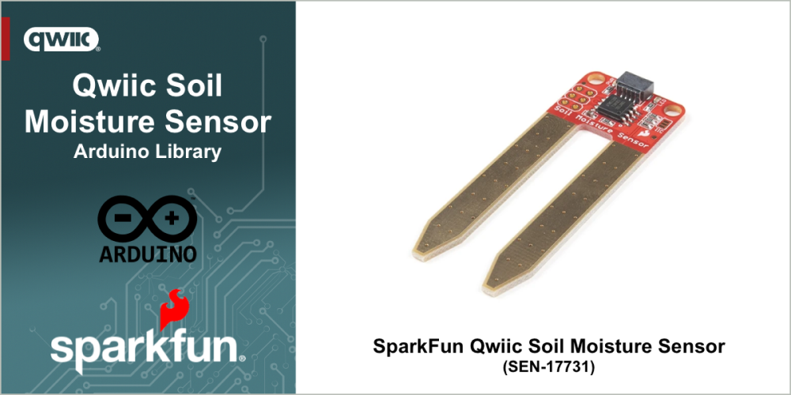

# SparkFun Qwiic Soil Moisture Sensor

Arduino Library for the SparkFun Qwiic Soil Moisture Sensor


The [SparkFun Qwiic Soil Moisture Sensor (SEN-17731)](https://www.sparkfun.com/sparkfun-qwiic-soil-moisture-sensor.html) is a simple breakout for measuring the moisture in soil and similar materials. The soil moisture sensor is pretty straightforward to use. The two large, exposed pads function as probes for the sensor, together acting as a variable resistor. The more water that is in the soil means the better the conductivity between the pads will be, resulting in a lower resistance and a higher SIG out. 

Looking for the board that matches this library - pick up a [SparkFun Qwiic Soil Moisture Sensor (SEN-17731)](https://www.sparkfun.com/sparkfun-qwiic-soil-moisture-sensor.html) at www.sparkfun.com.

## Functionality

This library provides a simple interface that enables the following functionality when using the SparkFun Qwiic Soil Moisture Sensor:

* Read the current resistance (moisture) value from the sensor
* Turn the on-board LED on and off
* Change the I2C address of the sensor - if you want to avoid a conflict, or used multiple moisture sensors together. 

## General Use 

The following outlines the general use of the library in an Arduino Sketch. 

### Declaration

At the start of your sketch, the library header file is included using the following statement:

~~~c++
#include "SparkFun_Soil_Moisture_Sensor.h" 
~~~

Before the arduino ```setup()``` function, create a Soil Sensor object in your file with the following declaration:

For I2C bus:
```c++
SparkFunSoilMoistureSensorI2C mySoilSensor; // Create an instance of the sensor class
```

For SPI bus:
```c++
SparkFunSoilMoistureSensorSPI mySoilSensor; // Create an instance of the sensor class
```


### Initialization

In the Arduino ```setup()``` function, initialize the sensor by calling the begin method. This method is called after the Arduino `Wire` (I2C) library is initialized. 

```c++
if (mySoilSensor.begin() == false)
{
    Serial.println("Soil Moisture Sensor not detected at default I2C address. Verify the sensor is connected. Stopping.");
    while (1)
        ;
}
```

The begin method returns true if the sensor is connected and available, and false if it is not. If a value of ```false``` is returned in the above example, the  sketch execution is halted.

### Usage

#### Read Value
To read the value from the sensor, the ```readMoistureValue()``` method is called on the sensor object.

```c++
uint16_t soilMoisture = mySoilSensor.readMoistureValue();
```

The value returned is from 0 (100% wet) to 1023 (0% web - "dry"). The value is a measurement of resistance between the sensors two probes. The value range is based on the capabilities of the Analog to Digital converter (ADC) on the sensors microcontroller - it's 10 bits with a max value of 2^10 = 1024. 

To read the percent moist value, call the ```readMoisturePercentage()``` method:

```c++
float percent = mySoilSensor.readMoisturePercentage();
```

To read the moisture ration value (0 - 1.0), call the ```readMoistureRation()``` method:

```c++
float wetRatio = mySoilSensor.readMoistureRatio();
```

#### Control the On-Sensor LED

The Soil Sensor has user controllable LED and the library has two methods to control if the LED is on or off. The following example shows how to *wink* the LED. 

```c++
// Wink the LED during the reading
mySoilSensor.LEDOn();
delay(100);
mySoilSensor.LEDOff();
```

## Examples

The following examples are provided with the library

- [Basic Readings](examples/Example_01_BasicReadings/Example_01_BasicReadings.ino) - Setup and read the soil moisture from the sensor
- [Readings and LED](examples/Example_02_ReadingsAndLED/Example_02_ReadingsAndLED.ino) - Flash the sensor LED when reading the moisture value
- [LED Flash Based on Moisture Percentage](examples/Example_03_LEDFlashMoisture/Example_03_LEDFlashMoisture.ino) - Vary the sensor LED flash rate based on the moisture percent sensed. The flash rate increases the drier the sensed value

## Documentation

The full API and use documentation for this library is provided [here](docs.sparkfun.com/SparkFun_Soil_Moisture_Arduino_Library/). For a quick reference, the main methods available in the library are listed [here](https://docs.sparkfun.com/SparkFun_Soil_Moisture_Arduino_Library/functions.html).

Curious about the hardware this board works with - visit the SparkFun Qwiic Soil Moisture Sensor [hardware repository](https://github.com/sparkfun/Zio-Qwiic-Soil-Moisture-Sensor).

The Hookup Guide for the SparkFun Qwiic Soil Moisture Sensor is available [here](https://learn.sparkfun.com/tutorials/soil-moisture-sensor-hookup-guide).

## License Information

This product is ***open source***!

This product is licensed using the [MIT Open Source License](https://opensource.org/license/mit). 